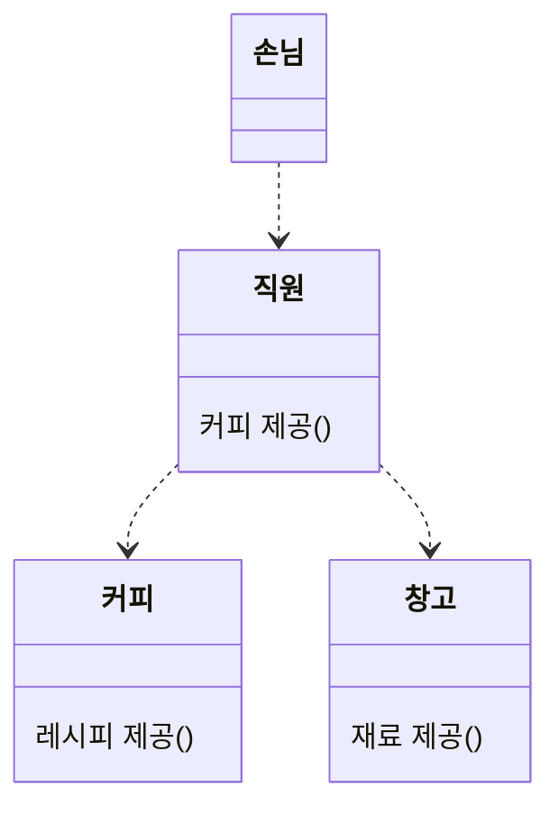

# 미션 코스 1주차

<<<<<<< HEAD
## 개념 정리와 미션
이번 주차에서는 개념 정리와 미션 2가지를 진행할 거예요.  
개념 정리를 진행한 후에 미션 코스를 진행해주세요.  
중요 개념인 객체지향에 대해선 미리 내용을 준비했고, 그 외 내용은 제공드린 자료를 통해 스스로 공부해 보아요.

### [객체지향 공부해보기](./articles/object.md)
### [인터페이스 공부해보기](./articles/interface.md)

여기까지 개념 공부하느라 수고하셨어요!  
그럼 이제 본격적으로 미션을 수행해볼까요?  
[미션코스 1주차 명세서](./1st-spec.md)

## 안내: 이번 미션은 순수한 Java 코드로 진행됩니다.
=======
## 이번 미션은 순수한 Java 코드로 진행됩니다.

>>>>>>> 3c9950e (docs: 테스트)
스프링을 위한 미션 코스인데 왜 그런지 의문이 드실 수 있을 것 같아요.  
왜 그런 식으로 진행하는지 간단하게 설명해볼게요.  
저는 백엔드 프로젝트를 크게 3개의 계층으로 나눠서 생각해요. 디자인 패턴으로는 3-Tier Architecture 라고도 하죠.  
DB 와의 통신을 담당하는 DB 계층, 서비스 관련 로직을 담당하는 서비스 계층, 전달하는 통신 계층 이렇게 3개예요.

DB 계층은 ORM, 흔히 사용하는 JPA, 하이버네이트 를 통해 구현돼요.  
통신 계층은 스프링 프레임워크를 통해 구현돼요.  
즉, 이 둘은 생각보다 정형화되어있고, 어떻게든 작동하면 전체 서비스는 작동한다고 생각해요.

하지만, 서비스 계층은 이야기가 조금 달라요.  
받은 데이터 기반으로 가공, 처리, 검증을 통해 필요한 정보를 넘겨야하죠.  
서비스마다 천차만별이기 때문에, 전형적인 자료를 찾기 어렵다고 생각해요.  
즉, 이런 부분을 도와주는 것이 향후 백엔드 서비스 구축에 조금 더 도움이 되지 않을까 싶어 이런 방식을 채택했어요.

<<<<<<< HEAD
---
=======
## 객체지향

여러분은 객체지향을 얼마나 알고 계신가요?  
첫 주차에는 프레임워크 없이 순수 언어를 사용해서 하는 이번 미션을 통해  
객체지향을 되돌아 보아요.

여러분은 `객체지향` 하면 어떤 말이 떠오르나요?  
저는 정의를 먼저 확인하는걸 좋아하는데요  
위키피디아에 따르면...

```
Object-oriented programming (OOP) is a programming paradigm
based on the concept of objects which can contain data and code.
```

...별 도움은 되지 않는군요.  
굳이 찾아보자면, Object, 즉 객체라는 개념에 중심을 둔 패러다임이라고 하는군요.
>>>>>>> 3c9950e (docs: 테스트)

# 미션 코스 2주차
지난 1주차 미션은 할만했나요?  
이번 2주차에서는 1주차에서 만든 서비스 로직을 활용하여 API 를 제작해보려고 해요.  
그 전에 지난 주차 리뷰와 개념 공부를 하고 넘어가 봅시다.  

<<<<<<< HEAD
## 코드 리뷰

TODO: spring 의 기본적인 개념 소개  
TODO: VO, DTO, DAO 공부해보기

코드 리뷰는 실무나 프로젝트 모두에서 중요해요.  
버그는 없는지, 더 나은 방법은 없는지, 새로운 인사이트를 얻는다든지 코드에 대한 유지보수를 고민하게 해줘요.  
각자의 팀에서 2명이 짝이 되어 서로의 1주차 제출 PR에 리뷰를 남겨보아요.  
기업에서는 어떤 식으로 진행하는지 궁금하시다면 다음 링크들을 참고해주세요.  
* [화해](https://blog.hwahae.co.kr/all/tech/12534)
* [vinu](https://www.vinuteam.com/blog/25)

> ⚠️ 주의    
> 코드 리뷰는 함께 성장하고자 하는 행동입니다.  
> 남을 가르치거나, 비방하는 말투는 지양해주세요.

## 개념 정리
이번 주차부터는 spring 을 본격적으로 사용하기 시작해요.  
이에 스프링에 대한 기초적인 지식을 점검하고, 지난 시간에 공부한 객체에 대해 좀 더 세분화해서 공부해보아요.  

### [VO, DTO, DAO](./articles/object2.md)
### [spring 기초](./articles/spring.md)
=======
### 객체란?

현실의 문제를 객체간의 `협력 관계`를 통해 해결하고자 하는 것이 객체지향의 목적이에요.  
좀 더 풀어서 말하면, 각 객체에게 일정한 `책임`을 부과하고, 객체 간에 `메세지` 를 통해, `협력` 하여 주어진 문제를 해결해요.

예를 들어보면, 카페에서 손님이 직원에게 커피를 사려고 한다고 해볼게요.



직원은 손님에게 `커피를 제공`이라는 `메세지`를 받았어요.  
이에 직원은 커피를 만들어 제공해야하는 `책임` 이 생겼어요.  
직원은 `커피 제공` 이라는 `책임`을 위해 `커피` 와 `창고` 객체의 `협력` 을 받아요.

이런 식으로, 객체지향은 객체간의 `협력` 으로 문제를 해결해요.

### 객체 설계하기

객체지향적 설계를 위해서는 `메세지`, 혹은 기능을 먼저 정의해야 해요.  
이 `메세지` 를 묶어 `책임` 을 설정하고, `협력 관계` 를 구성해요.  
바로 위의 예시를 가져와볼게요.  
커피 주문이라는 문제를 위해서는 다음과 같은 기능이 필요해요.

- 커피를 만들기
- 재료를 파악하기
- (재료가 무제한은 아닐테니) 재료의 양을 구하기
- 재료의 양을 관리하기

이 정도로 정리해볼게요.  
책임을 부과해본다면,

- 커피 만들기는 직원이
- 재료를 파악하기는 커피가
- 재료의 양을 구하고, 관리하기는 창고가

하는 것이 자연스러워보여요. 협력 관계도 볼까요?  
커피를 만들기 위해, 커피에게 재료를 파악 후, 창고에게 만들 수 있는지 확인하면 되겠네요.
>>>>>>> 3c9950e (docs: 테스트)

공부하느라 수고하셨습니다!  
그럼 2주차 미션도 진행해보아요.  
[2주차 미션코스 명세서](./2nd-spec.md)